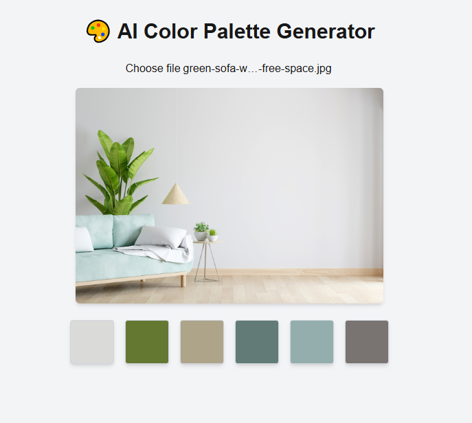

# 🎨 AI Color Palette Generator

An AI-powered web app that extracts dominant colors from any uploaded image and displays a beautiful, interactive color palette.

> Built with **Next.js (App Router)**, **TypeScript**, and `color-thief-browser`

---

## 🚀 Features

- 📷 Upload any image (PNG, JPG)
- 🧠 Automatically extract 5–6 dominant colors
- 🎨 Display the color palette with HEX codes
- 💡 Built using `color-thief` for color extraction
- 💻 Fully responsive & easy to use

---

## 🛠 Tech Stack

- [Next.js 13+](https://nextjs.org/)
- [TypeScript](https://www.typescriptlang.org/)
- [Tailwind CSS](https://tailwindcss.com/)
- [color-thief-browser](https://www.npmjs.com/package/color-thief-browser)

---

## 📸 Screenshot



---

## 📂 How to Run Locally

```bash
git clone https://github.com/your-username/ai-color-palette-generator.git
cd ai-color-palette-generator
npm install
npm run dev
